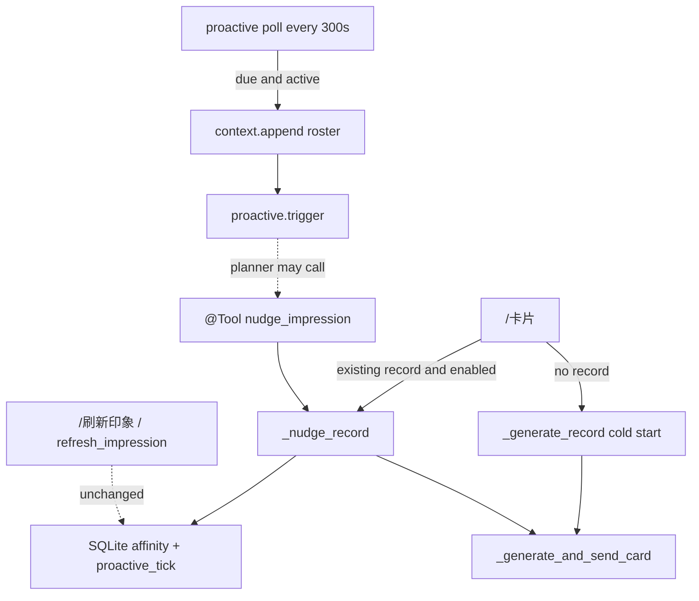

# Impression Card — Light Nudge + Periodic Planner Reminder

**Date:** 2026-08-13  
**Status:** Approved (brainstorming)  
**Plugin directory:** `maibot-impression-card-plugin/`  
**Plugin ID:** `com.0-hz.impression-card`  
**Versions:** plugin `0.2.7` → `0.3.0`; `config_version` `0.2.3` → `0.3.0`  
**Architecture:** Shared light-nudge engine; `/卡片` + new `nudge_impression` tool; independent 6-hour Maisaka reminder loop

## Summary

When someone runs `/卡片` (self or others), optionally run a **small, fast LLM pass** that asks for **adjustments** (score deltas + optional note tweak) instead of brand-new absolute scores, then persist and render. A separate optional loop, default on, wakes Maisaka every 6 hours in chats that actually had traffic, with a short roster briefing, and asks the planner whether anyone’s card needs a cheap update.

Both features are independently togglable. Turning light-nudge off restores today’s `/卡片` (render stored card; cold-start only if no record).

## Problem

`/卡片` is a lookup: it renders whatever is in SQLite. The only way to refresh is the **heavy** path (`/刷新印象` / `refresh_impression`): long-term memory via `knowledge.search`, up to 512 recent messages, absolute rescoring of all 22 dimensions. That is too expensive and too admin-gated to run whenever someone is curious.

Interest in a card is a good moment for a **small** update. Separately, the planner is never reminded to revisit impressions, so cards go stale in active chats unless a human runs the heavy command.

## Goals

- Light nudge on every `/卡片` of an existing record (self or others), default on, no cooldown
- Same engine exposed as `@Tool nudge_impression` so the planner can cheap-update during the periodic reminder
- LLM input is small: current scores + short identity/personality + a slice of **this stream’s** recent chat; **no** `knowledge.search` / `memory_points` dump
- LLM output is deltas + optional full-note replacement (omit = keep)
- No 【系统通知】 on light nudge
- Independent 6-hour Maisaka reminder for **active** chats (at least one message in the interval), default on
- Reminder = `context.append` roster briefing + `proactive.trigger`; prefer silence unless the planner actually sends a card
- Plugin-only; no Host/SDK source changes
- Existing `config.toml` needs no edits (missing fields follow new defaults)

## Non-goals

- Auto light-nudge on `send_impression_card` (its `refresh_first` stays the **heavy** refresh)
- Behavior change to `/刷新印象` / `refresh_impression` / cold-start / card templates / dimension schema (heavy refresh may mention `nudge_impression` in its tool description only)
- Cooldown / debounce on `/卡片`
- Light-nudge 【系统通知】
- Plugin-side auto-update of cards on the 6-hour tick (the planner decides)
- Host/SDK patches
- Splitting `plugin.py` (keep the existing single-file layout)

## Decisions (from brainstorming)

| Topic | Choice |
|---|---|
| Who gets light nudge | Any `/卡片` (self or others), not `send_impression_card` |
| Repeat `/卡片` | Always nudge (no cooldown) |
| 【系统通知】 | Never on light nudge |
| Note change | Optional full replacement; omit/empty = keep |
| Long persistent journal | Do not overwrite; scores may still change |
| Implementation | Shared engine: `/卡片` + new `nudge_impression` tool |
| Periodic reminder payload | Intent + `context.append` briefing (recent speakers + totals / last-updated) |
| Periodic chat visibility | Prefer silence; speak only if sending a card |
| Light-nudge timeout | Reuse `[general] llm_rpc_timeout_ms` (default 120000) |
| `max_abs_delta` | Default `0` = no clamp; positive value clamps each key |
| Loop poll | `poll_seconds = 300` (scan cadence, not fire cadence) |
| Fire cadence | `interval_hours = 6` per stream |
| First discovery | Record `last_fired_at = now`; do **not** fire immediately |
| `light_refresh.enabled` | Gates `/卡片` only; `nudge_impression` stays callable |

## Reference

| Source | Patterns reused |
|---|---|
| Existing `_generate_record` / `_refresh_record` | Personality header, JSON parse, persist, per-person gen lock |
| Existing `_recent_chat_text` | `message.build_readable` on current `stream_id` |
| `MaiBot-rss-reader` | `asyncio` poll loop, `context.append` + `proactive.trigger`, templated intent |
| SDK `ctx.maisaka` | `maisaka.proactive.trigger`, `maisaka.context.append` |
| SDK `ctx.chat` | `get_all_streams(platform="all_platforms")` |
| SDK `ctx.message` | `count_new`, `get_recent` / `get_by_time_in_chat` |

---

## Architecture



One engine, two callers. The 6-hour loop does **not** call the engine itself.

`light_refresh.enabled` gates **only** `/卡片`. `nudge_impression` stays callable so a disabled slash-command nudge does not force the planner onto the heavy refresh. `proactive.enabled` gates the loop independently.

Cold-start on first `/卡片` is today’s full generate only — no extra light pass afterward.

---

## Light-nudge engine

### When it runs

| Caller | Condition | On success | On LLM/JSON failure |
|---|---|---|---|
| `/卡片` | `light_refresh.enabled` and a record already exists | Persist, then render | Keep stored record, still render |
| `/卡片` | no record | Cold-start only (no extra nudge) | today’s cold-start fallback |
| `/卡片` | `light_refresh.enabled = false` | Skip engine; render stored / cold-start as today | — |
| `nudge_impression` | existing record (ignores `light_refresh.enabled`) | Persist; return Markdown of changes | Return error string; no write |
| `nudge_impression` | no record | Do **not** cold-start; return that there is no archive yet | — |

Use the existing per-`person_id` generate lock so concurrent `/卡片` + tool do not double-write.

### Context (small)

Include:

- Bot nickname / personality / reply_style (same as today)
- Person identity lines (existing `_format_person_identities`)
- Current `{total_label}` and **all** dimension scores (baseline for deltas)
- Current note: full text if it fits in `size_limit`; otherwise a truncated preview plus a flag that the journal is long and must not be replaced
- Recent chat of **this** `stream_id` only: `recent_hours` (default 6) and `recent_messages_limit` (default 48)

Do **not** include: `knowledge.search`, `memory_points`, 512-message dump, or the heavy `refresh_guidance`.

### Prompt contract

Built-in template (overridable via `light_refresh.prompt_template`). Same “印象卡片模块 / named AI lifeform” framing as the compact and cold-start prompts.

Ask the model to:

- Return **adjustments**, not new absolute scores
- Omit keys that should not move
- Prefer small moves; it may still move more (`max_abs_delta` default unlimited)
- Optionally return a lightly edited full note; omit to keep
- Output **only** one JSON object

Placeholders: `{nickname}{personality}{reply_style}{name}{total_label}{scale_min}{scale_max}{default_score}{dimensions_doc}{current_scores_block}{current_note}{note_policy}{person_identities}{recent_chat}{size_limit}`.

### JSON

```json
{"deltas": {"total": 0.3, "joy": -0.2}, "description": "可选"}
```

Apply:

1. Missing/invalid JSON → no write.
2. Unknown keys in `deltas` → ignore.
3. Omitted key → 0.
4. If `max_abs_delta > 0`, clamp each delta to `±max_abs_delta`. If `max_abs_delta == 0`, do not clamp.
5. `new = old + delta` (no scale bounds; scores may still go out of range, same as today).
6. `description` empty/omitted → keep.
7. If `persistent_impression` is on **and** stored note character length `> size_limit` → ignore `description` even if present (scores still apply). `size_limit` is the card character cap, not `impression_note_size_limit` bytes.
8. Otherwise replace the note; existing compact-on-write / card-display compact paths still apply.
9. `updated_at = now`; upsert.

No 【系统通知】 from this path.

Model / temperature / max_tokens come from `[light_refresh]` (model empty → `cold_start.model`). RPC timeout is `[general] llm_rpc_timeout_ms`.

---

## `/卡片` and tools

### `/卡片`

1. Resolve target (unchanged, including `allow_query_others`).
2. If no record → `_load_or_create` (cold-start) → render.
3. If record exists and light-nudge enabled → `_nudge_record` → render.
4. If record exists and light-nudge disabled → render as today.
5. No extra chat line (“正在刷新…”). The card is the only user-visible output (plus today’s Maisaka card-summary `context.append` after send).

`/刷新印象` unchanged (heavy, `refresh_admin_only`).

### `@Tool nudge_impression`

- `target` rules identical to `adjust_score` (QQ / nick / alias / group card / `person_id`; omit = current speaker).
- Not admin-gated (same as other tools). Not gated by `light_refresh.enabled` (`/卡片` is).
- If the target has no affinity row, return an error string and do **not** cold-start.
- Returns Markdown: who, applied deltas (label + signed number), whether the note changed, then the updated archive via `_render_detail_markdown`.
- Does **not** send a card. Planner may call `send_impression_card` if it wants to show one.

### `@Tool refresh_impression`

Add one sentence to the tool description: for small updates prefer `nudge_impression`; this tool is a full recompute.

### `send_impression_card`

Unchanged. `refresh_first` still means heavy `_refresh_record`. No auto light-nudge.

---

## Periodic reminder loop

RSS-style asyncio task: start in `on_load`, cancel in `on_unload`, restart on `on_config_update`. Scan every `poll_seconds` (default **300**). Fire at most once per stream per `interval_hours` (default **6**).

### Config `[proactive]`

| Key | Default | Role |
|---|---|---|
| `enabled` | `true` | Independent of `[light_refresh] enabled` |
| `interval_hours` | `6` | Per-stream fire cadence |
| `poll_seconds` | `300` | Scan cadence |
| `max_briefing_people` | `12` | Roster cap |
| `max_streams_per_tick` | `5` | Remaining due streams wait for the next poll |
| `intent_template` | built-in | `proactive.trigger` intent |
| `briefing_template` | built-in | `context.append` body |

### Eligibility (all must hold)

1. Plugin `enabled` and `proactive.enabled`.
2. Stream from `chat.get_all_streams(platform="all_platforms")` (group and private).
3. `now - last_fired_at >= interval_hours * 3600`.
4. `message.count_new(chat_id, since=str(now - interval)) >= 1`.

Check local `last_fired_at` **before** `count_new` so most scans do not RPC per stream.

### Persistence

Same SQLite file as affinity. New table:

```sql
CREATE TABLE IF NOT EXISTS proactive_tick (
    stream_id TEXT PRIMARY KEY,
    last_fired_at REAL NOT NULL
)
```

- Restart does not re-fire streams that already fired within the interval.
- Stream never seen before: insert `last_fired_at = now`, **do not fire** on first discovery (avoids an upgrade/restart stampede).

### On fire (sequential, up to `max_streams_per_tick`)

1. Unique speakers from messages in the last interval, newest first, cap `max_briefing_people`. Call `message.get_by_time_in_chat`; if that fails, `message.get_recent` with a modest limit and the same cap. Skip the bot’s own `user_id`. Unresolvable senders are listed by nickname only, without card stats.
2. For each resolved person: if an affinity row exists → `{total_label}` and `updated_at`; else 「尚无档案」. No notes, no full radar.
3. `maisaka.context.append` with `source_kind="plugin:com.0-hz.impression-card"`. Visible text: a short internal label, e.g. `印象卡片定期提醒`.
4. `maisaka.proactive.trigger` with `reason="impression_card_periodic"`.
5. Write `last_fired_at = now` **after** append+trigger attempt (even if trigger fails, so a broken stream does not retry every poll). Log failures.

One stream’s exception does not stop the loop or the rest of the tick.

### Built-in intent (zh-CN)

State clearly:

- This is an **internal** reminder, not a user message.
- **Do not speak** in chat unless you actually send an impression card.
- If someone in the briefing seems off, prefer `nudge_impression`.
- Use `refresh_impression` only if something major happened.
- Doing nothing is fine.

---

## Config and versions

Additive. Existing live `config.toml` is not hand-edited; missing sections follow code defaults.

`CURRENT_CONFIG_VERSION = "0.3.0"`. No field rename migration required (keep existing `_migrate_config_dict` behavior).

New `LightRefreshSectionConfig` and `ProactiveSectionConfig` on `AffinityPluginConfig`, with zh-CN `description` / `__ui_label__` like other sections.

`[light_refresh]`:

| Key | Default | Notes |
|---|---|---|
| `enabled` | `true` | `false` → today’s `/卡片` |
| `recent_messages_limit` | `48` | vs 512 on full refresh |
| `recent_hours` | `6` | Current stream only |
| `model` | `""` → `cold_start.model` | |
| `temperature` | `0.4` | |
| `max_tokens` | `0` (auto) | |
| `max_abs_delta` | `0` | `0` = no clamp |
| `prompt_template` | `""` → built-in | |

No `timeout_ms` here. All `llm.generate` in this plugin, including light nudge, already use `[general] llm_rpc_timeout_ms` (default 120000).

Ship commented placeholders in `config.default.toml`. Bump `_manifest.json` `version` to `0.3.0`. README, CHANGELOG, and `/印象卡片帮助` text (new tool + `/卡片` light-nudge).

---

## Manifest capabilities

Declare every new `ctx.*` usage. Add at least:

- `maisaka.proactive.trigger`
- `chat.get_all_streams`
- `message.count_new`
- `message.get_by_time_in_chat` (primary roster query)
- `message.get_recent` (fallback if the time-range query fails)

`tests/smoke_test.py` `test_manifest_capabilities_cover_usage` today only special-cases `maisaka.context.append`. Extend it so `maisaka.proactive.trigger` (and any other `ctx.maisaka.*` dotted capability) is detected from source the same way.

---

## Error handling

| Failure | Behavior |
|---|---|
| Light-nudge LLM timeout / exception / bad JSON | `/卡片`: stored card still sent. Tool: error string, no write |
| Recent-chat fetch fails | Nudge with empty chat block (same as today’s refresh) |
| Long-note description returned | Ignore description; apply deltas |
| `proactive.trigger` / `context.append` fails | Log; still stamp `last_fired_at`; continue other streams |
| `get_all_streams` fails | Log; skip this poll |
| Plugin disabled / proactive disabled | Loop not running or tick no-ops |

---

## Testing (offline smoke, no Host)

Extend `tests/smoke_test.py` (and small pure helpers if that keeps `plugin.py` from growing test-unfriendly closures):

- Parse/apply deltas: add, omit, unknown keys, `max_abs_delta` 0 vs positive
- Persistent-note guard: long note + returned description → scores change, note unchanged
- Short note replacement vs omit
- Config: `enabled=false` is the skip flag; defaults `true` / `interval_hours=6` / `poll_seconds=300` / `max_abs_delta=0`
- Eligibility helper: too soon / inactive / due
- First-seen stream is recorded and not treated as due
- Briefing formatter: with card / 尚无档案 / cap
- Manifest capabilities include new calls
- `config.default.toml` sections match the model
- Default `config_version` is `0.3.0`

No live LLM or live Maisaka in smoke tests.

---

## Unchanged

- Cold-start prompt and `_generate_record` absolute JSON (`total` + `scores` + `description`)
- `/刷新印象` admin gate
- `adjust_score` / `set_score` / `append_impression` / `rewrite_impression` / `get_impression_detail`
- `send_impression_card` including `refresh_first`
- Card HTML templates and image pipeline
- Affinity row schema (`updated_at` already exists; light nudge updates it)
- Cross-chat shared `person_id` store (light context is still **this** stream, same as full refresh)
